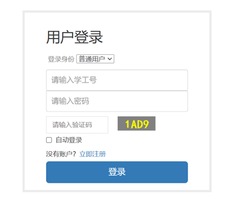
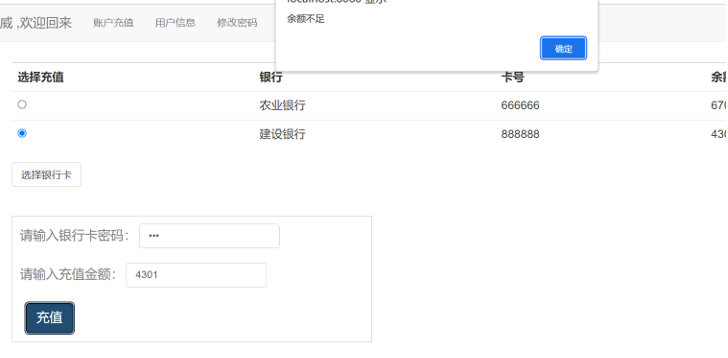
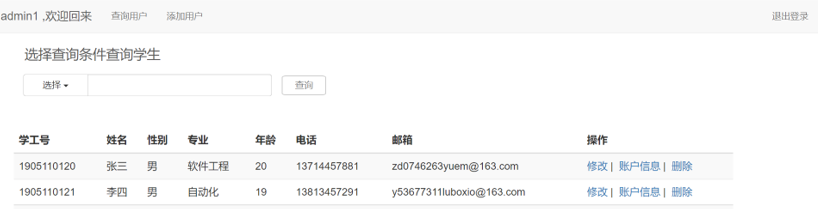
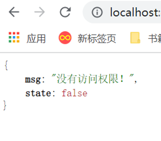

# Campus Card Management
 这是一个校园卡管理系统  
 &nbsp;&nbsp;&nbsp;校园卡管理系统描述：针对校内通用的校园卡需要统一管理这一需求而推出。通过这个程序，可以较为方便地实现用户的登陆以及个人信息的查询更改等服务，同时管理员将以特定的帐号登陆，实现对所有用户信息及账户信息的管理。
   
  **功能：**
   
（1）以用户身份登陆可查询个人信息，并对相关信息作出修改，提交后新信息将写入数据库，取代原有信息。可查询个人的帐户信息，包括帐户余额、今日消费、末次充值情况等。
     可实现网上充值，通过与银行卡的连接，只要用户输入正确密码，即可从银行卡往校园卡转帐，同时帐户信息中末次充值情况将自动更新。可修改个人的登陆信息，对登陆密码作出修改。
   
（2）以管理员身份登陆，可查阅所有用户的信息，以及他们对应的帐户信息。
     可对用户信息作出相应的增删改操作，并自动将修改写入数据库，实现更新。通过输入任意确定条件，即可查询该用户的所有信息，包括个人信息及账户信息，同时在此基础上，实现增删改。
        
**技术栈：**
SpringMVC / SpringBoot / JWT / Redis / MySQL / Mybatis / jQuery / JSTL

**部分功能展示：**
  登录 

  充值 
 
  管理员查询 
 
  安全验证 
 
